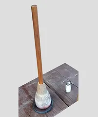

# Moje archiwum

Powstanie i prowadzenie tej strony ma na celu:

* ukazanie bogatego wzornictwa i tematyki pieczątek z obiektów i atrakcji turystycznych Polski oraz zmian jakie w nich
  zachodziły na przestrzeni lat,
* promocja bogatej bazy polskich obiektów i szlaków turystyczno-krajoznawczych,

* podobno w internecie nic nie ginie, więc postanowiłem tutaj właśnie zachować jak najdłużej w pamięci (może dla
  pokoleń) to wszystko, co wiąże się z kolekcjonowaniem pieczątek turystycznych.

Niektórych pieczątek, pomimo, iż zostały zdobyte w trakcie turystycznych wojaży - nie zbieram w archiwum:

* pieczęci stanowiskowych od urzędników państwowych (burmistrz, sołtys, prezydent, itp.) - bo nie powinno się tego
  robić, chyba że już są historyczne,

# Dlaczego i po co?

Na jednym z internetowych forów turystycznych znalazłem taką "rozmowę" dot. potwierdzania swojego pobytu przy pomocy
pieczątek:

> Nie, kategorycznie nie dla pieczątek. To zło w biurokratycznej postaci - chodzić i prosić się o pieczątki. (...)
> Strata czasu. Byłem, to byłem - kto nie wierzy jego problem...

> Z tymi pieczątkami to jest podobnie jak z gadżetami. Idę na mecz - po kiego wała mi szalik w środku lata? Albo
> kapelusz, czy koszulka z numerem 11, albo inne durne rzeczy? W zbieraniu potwierdzeń nie ma nic strasznego. Chyba, że
> ktoś wstydzi się poprosić o pieczątkę np. do książeczki GOT lub notesu.

